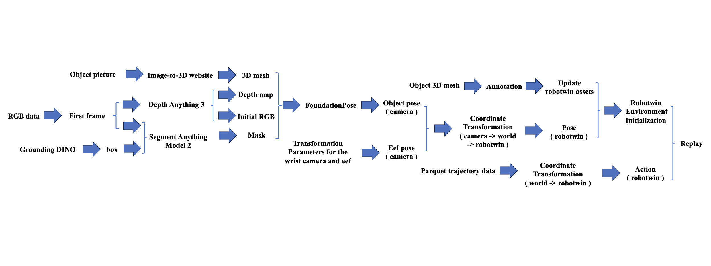
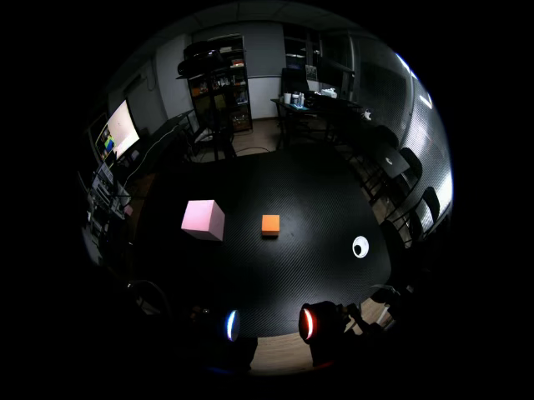
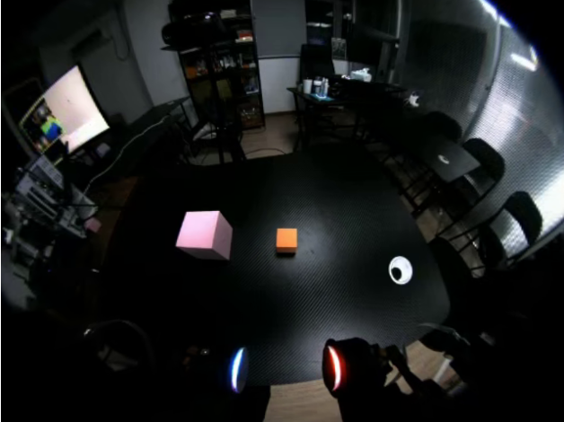
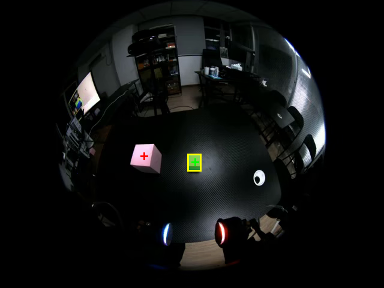
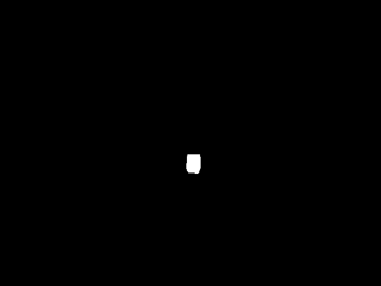
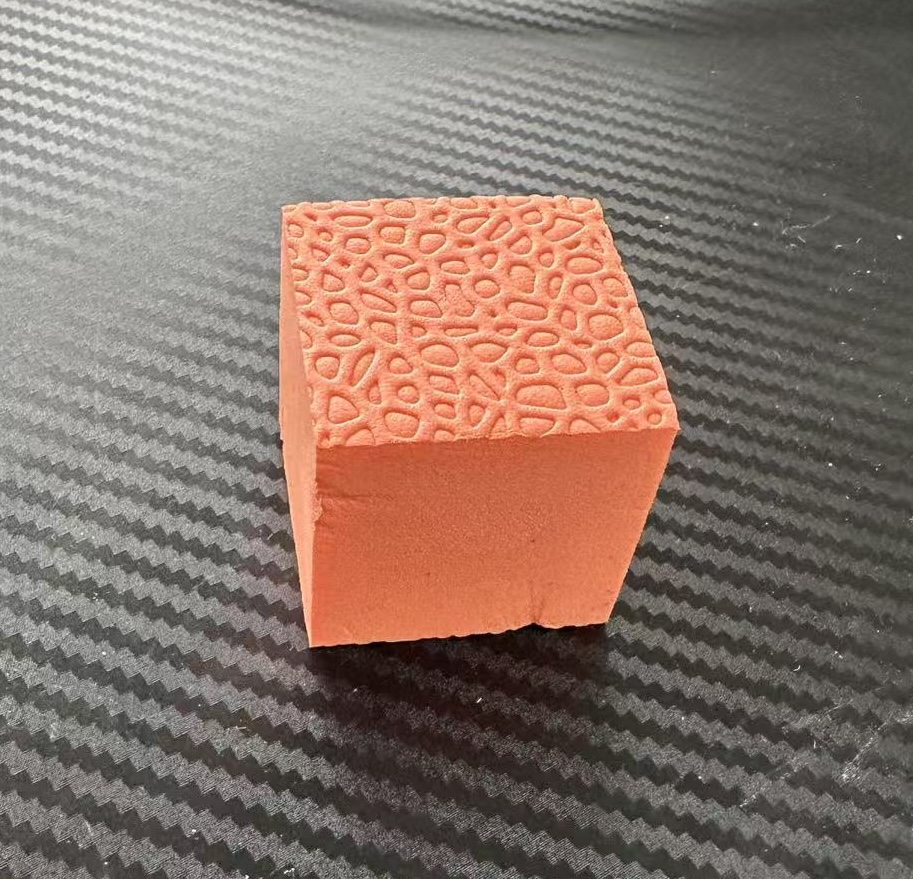

<h1 align="center">Real-2-Sim RoboTwin</h1>

<p align="center">
  <b>Automatic real-world replay initialization for RoboTwin</b><br>
  Recover object pose and end-effector pose from the first real wrist-camera frame, initialize the RoboTwin scene, then replay real robot trajectories in simulation.
</p>

<p align="center">
  <a href="#overview">Overview</a> ·
  <a href="#pipeline">Pipeline</a> ·
  <a href="#debug-gallery">Debug Gallery</a> ·
  <a href="#quick-start">Quick Start</a> ·
  <a href="#repository-layout">Repository Layout</a>
</p>

---

## Overview

This repository extends [RoboTwin](https://github.com/RoboTwin-Platform/RoboTwin) with an automatic initialization pipeline for real-to-sim replay. The target use case is: given a real LeRobot trajectory and the first RGB frame from an ALOHA wrist camera, recover the target object's camera-frame pose, transform it into the RoboTwin base frame, initialize the object and robot state in simulation, then start trajectory replay from a state consistent with the real episode.

The core transform is:

```text
^B T_O(t0) = ^B T_E(t0) @ ^E T_C @ ^C T_O(t0)
```

where:

| Symbol | Meaning |
| --- | --- |
| `^B T_E(t0)` | First-frame real end-effector pose from `observation.state[0][:6]` |
| `^C T_O(t0)` | FoundationPose object pose in wrist-camera coordinates |
| `^C T_E` | Fixed ALOHA wrist-camera to end-effector extrinsics |
| `^E T_C` | Inverse wrist-camera extrinsics |
| `^B T_O(t0)` | Target object pose in the RoboTwin-compatible base frame |

The current implementation focuses on the `block_stack` replay task and the object asset `121_orange-block`, while keeping the auto-init modules reusable for other RoboTwin tasks with object meshes and first-frame masks.

## Highlights

| Capability | Implementation |
| --- | --- |
| Real data ingestion | LeRobot v2.1 parquet + wrist camera video parsing |
| Camera preprocessing | Raw fisheye calibration, 1536x1536 to 480x480 resize, 640x480 center padding, runtime fisheye undistortion |
| Depth estimation | Depth Anything 3 metric depth inference on undistorted RGB with matching pinhole intrinsics |
| Target segmentation | SAM 2 prompt-based mask generation and mask undistortion |
| 6D pose estimation | FoundationPose registration from RGB, depth, mask, intrinsics, and object mesh |
| Asset alignment | GLB mesh scale handling and RoboTwin object asset updates |
| Coordinate conversion | Camera to real base to RoboTwin frame transforms |
| Replay initialization | Object placement and first-frame robot state initialization before replay |

## Pipeline

The end-to-end pipeline starts from a real wrist-camera RGB stream and trajectory parquet, then produces a RoboTwin-ready scene initialization and replay action sequence.

<p align="center">
  
</p>

### Data Flow

1. Extract the first wrist-camera RGB frame and first end-effector state from a LeRobot episode.
2. Convert the recorded 640x480 distorted wrist frame into an undistorted 640x480 RGB image with matching `K_undistorted_640`.
3. Run Depth Anything 3 on the undistorted RGB image to estimate metric depth.
4. Generate or load a target-object mask, then undistort the mask using the same camera mapping.
5. Run FoundationPose with RGB, depth, mask, intrinsics, and the object mesh to recover `^C T_O`.
6. Convert object and end-effector poses into RoboTwin coordinates.
7. Initialize the RoboTwin task scene and replay the trajectory.

## Demo

The following clip shows one real replay episode used by the auto-init debugging pipeline.

<p align="center">
  <video src="docs/assets/readme/1_episode_000000.mp4" controls muted width="100%"></video>
</p>

If the video does not render in your Markdown viewer, open it directly: [episode_000000.mp4](docs/assets/readme/1_episode_000000.mp4).

## Debug Gallery

The README examples below are ordered by the actual debugging sequence. They show the intermediate artifacts produced by camera preprocessing, Depth Anything 3, SAM 2, object asset preparation, and FoundationPose.

### 1. First Frame And Camera Preprocessing

The real wrist stream is a 640x480 distorted fisheye image. It is not directly calibrated by the original 1536x1536 intrinsics. The runtime pipeline first constructs `K_distorted_640` from `K_raw_1536`, then undistorts the frame and writes the final `K_undistorted_640` for DA3 and FoundationPose.

<table>
  <tr>
    <td width="50%" align="center">
      <br>
      <b>Distorted first wrist frame</b>
    </td>
    <td width="50%" align="center">
      <br>
      <b>Undistorted frame for DA3 and FoundationPose</b>
    </td>
  </tr>
</table>

### 2. Depth Anything 3 Output

Depth Anything 3 receives only the undistorted RGB image and the matching pinhole intrinsics. The debug output records depth shape, finite ratio, positive-depth ratio, global statistics, and target-mask depth statistics.

<table>
  <tr>
    <td width="50%" align="center">
      <br>
      <b>Depth Anything 3 depth visualization</b>
    </td>
    <td width="50%" align="center">
      <br>
      <b>Depth map diagnostic plot</b>
    </td>
  </tr>
</table>

### 3. SAM 2 Target Mask

The object mask is generated from prompt boxes and points, then converted into a binary mask. When the RGB frame is undistorted, the mask is undistorted with the same mapping to keep RGB, depth, mask, and intrinsics aligned.

<table>
  <tr>
    <td width="50%" align="center">
      <br>
      <b>SAM 2 mask overlay on first frame</b>
    </td>
    <td width="50%" align="center">
      <br>
      <b>Undistorted binary mask</b>
    </td>
  </tr>
</table>

### 4. Object Asset Preparation

FoundationPose needs a geometrically correct object mesh. The workflow starts from a real object photo, creates a textured 3D mesh, then updates RoboTwin object assets and verifies scale/pose inside the simulator.

<table>
  <tr>
    <td width="33%" align="center">
      <br>
      <b>Target object photo</b>
    </td>
    <td width="33%" align="center">
      <br>
      <b>Generated GLB mesh</b>
    </td>
    <td width="33%" align="center">
      <br>
      <b>RoboTwin asset annotation</b>
    </td>
  </tr>
</table>

### 5. FoundationPose Registration

FoundationPose consumes the aligned RGB, depth, mask, camera intrinsics, and object mesh. The debug overlay projects the estimated mesh bounding box and object-frame axes back onto the wrist image.

<table>
  <tr>
    <td width="60%" align="center">
      <br>
      <b>FoundationPose pose overlay</b>
    </td>
    <td width="40%" align="center">
      <br>
      <b>Magnified object-frame axes and mesh projection</b>
    </td>
  </tr>
</table>

## Quick Start

The replay policy code is under `policy/Replay_Policy`. The typical server-side workflow is:

```bash
cd RoboTwin/policy/Replay_Policy

python auto_init/debug_camera_calibration_outputs.py \
  --config deploy_policy.yml \
  --data-dir data/handcap2603/block_stack_0401 \
  --episode-index 0

python auto_init/debug_depth_anything.py \
  --config deploy_policy.yml \
  --data-dir data/handcap2603/block_stack_0401 \
  --episode-index 0

python auto_init/debug_foundationpose.py \
  --config deploy_policy.yml \
  --data-dir data/handcap2603/block_stack_0401 \
  --episode-index 0

python auto_init/build_init_meta.py \
  --config deploy_policy.yml \
  --data-dir data/handcap2603/block_stack_0401 \
  --episode-index 0 \
  --output init_meta/init_meta.json
```

After `init_meta.json` is generated, run the replay task with:

```bash
bash eval.sh
```

## Camera Model

The current wrist-camera preprocessing explicitly separates three camera matrices:

| Matrix | Resolution | Role |
| --- | --- | --- |
| `K_raw_1536`, `D_raw` | 1536x1536 | Original fisheye calibration from `fisheye_calib_result.npz` |
| `K_distorted_640` | 640x480 | Intrinsics of the recorded distorted frame after 1536x1536 to 480x480 resize and 80-pixel horizontal padding |
| `K_undistorted_640` | 640x480 | Final pinhole intrinsics written to JSON and passed to Depth Anything 3 / FoundationPose |

The conversion from `K_raw_1536` to `K_distorted_640` is:

```text
s = 480 / 1536
tx = 80
ty = 0

fx' = s * fx
fy' = s * fy
cx' = s * cx + tx
cy' = s * cy + ty
```

This prevents mixing raw fisheye intrinsics, resized distorted-frame intrinsics, and final undistorted pinhole intrinsics.

## Repository Layout

```text
.
├── envs/replay_block_auto_init.py                 # RoboTwin task with auto-init
├── task_config/replay_block_auto_init.yml         # Task config
├── policy/Replay_Policy/
│   ├── deploy_policy.yml                          # Main replay + auto-init config
│   ├── deploy_policy.py                           # Replay entry
│   ├── replay_lerobot_loader.py                   # LeRobot v2.1 data reader
│   ├── 坐标系转换.py                                # Coordinate transformations
│   └── auto_init/
│       ├── real_data_reader.py                    # First-frame RGB/state extraction
│       ├── camera_calibration.py                  # Fisheye preprocessing and intrinsics
│       ├── generate_sam_mask.py                   # SAM 2 mask generation
│       ├── run_depth_anything_metric.py           # Depth Anything 3 runner
│       ├── run_foundationpose_once.py             # FoundationPose runner
│       ├── build_init_meta.py                     # End-to-end init metadata builder
│       └── debug_*.py                             # Step-by-step diagnostics
├── assets/objects/                                # RoboTwin object assets
└── docs/assets/readme/                            # README media and debug examples
```

## Main Configuration

The central configuration file is:

```text
policy/Replay_Policy/deploy_policy.yml
```

Important fields:

| Field | Purpose |
| --- | --- |
| `data_dir` | LeRobot episode directory |
| `auto_init.camera_calibration.path` | Raw fisheye calibration `.npz` |
| `auto_init.undistort.enabled` | Whether to undistort RGB and mask before DA3/FP |
| `auto_init.mask.template` | Default target-object mask path |
| `auto_init.depth_anything.command` | Depth Anything 3 execution command |
| `auto_init.foundationpose.command` | FoundationPose execution command |
| `object_config_path` | Object mesh and RoboTwin asset selection |

## Acknowledgements

This project builds on the RoboTwin manipulation benchmark and integrates several strong foundation models/tools:

| Component | Role |
| --- | --- |
| [RoboTwin](https://github.com/RoboTwin-Platform/RoboTwin) | Simulation, task assets, replay environment |
| Depth Anything 3 | Metric monocular depth estimation |
| SAM 2 | Prompt-based target object segmentation |
| FoundationPose | 6D object pose estimation |
| LeRobot | Real trajectory data format |

If you use the RoboTwin platform, please also cite the original RoboTwin papers and follow their license requirements.
